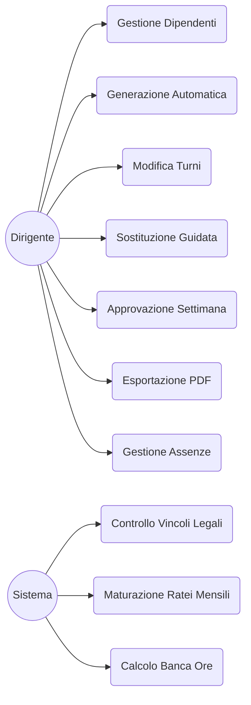
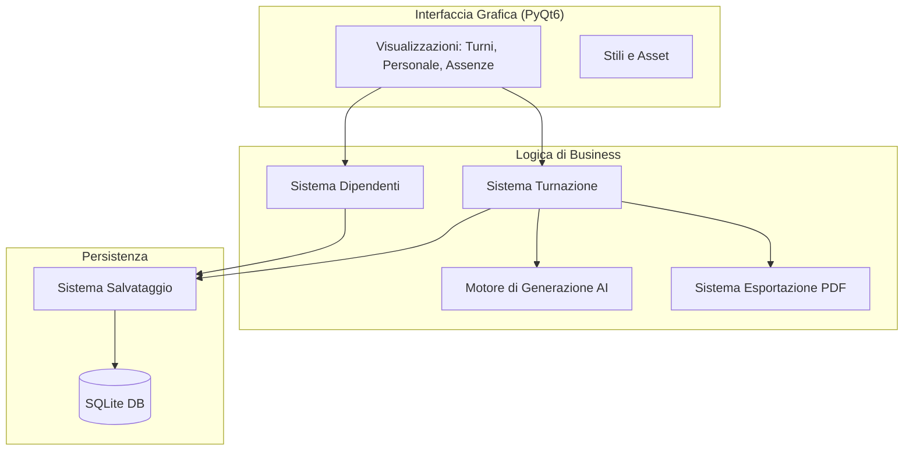
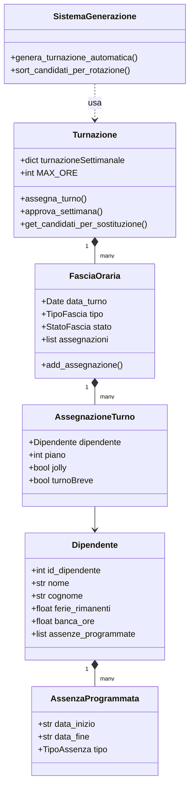
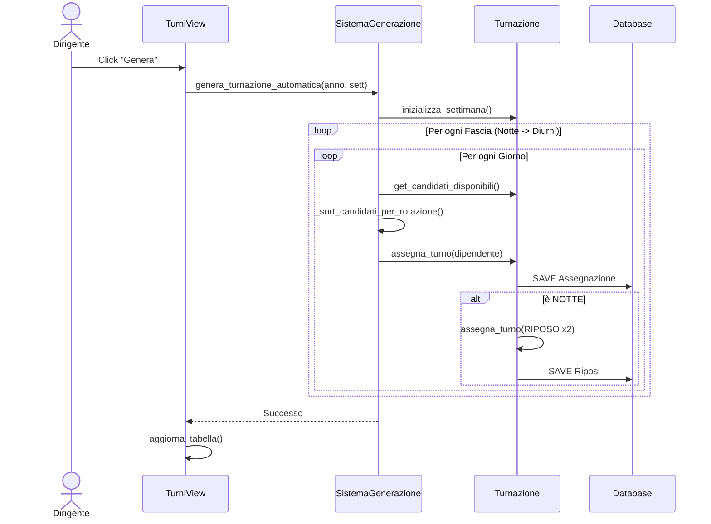
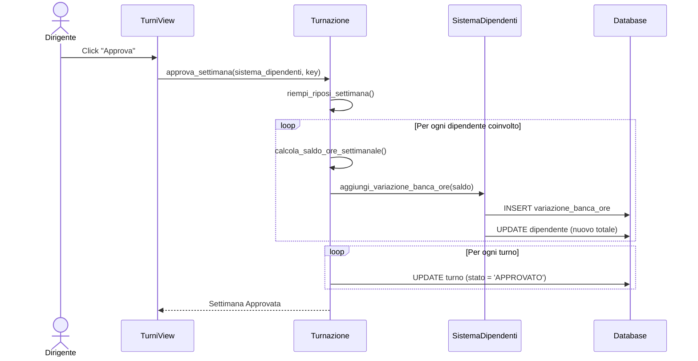
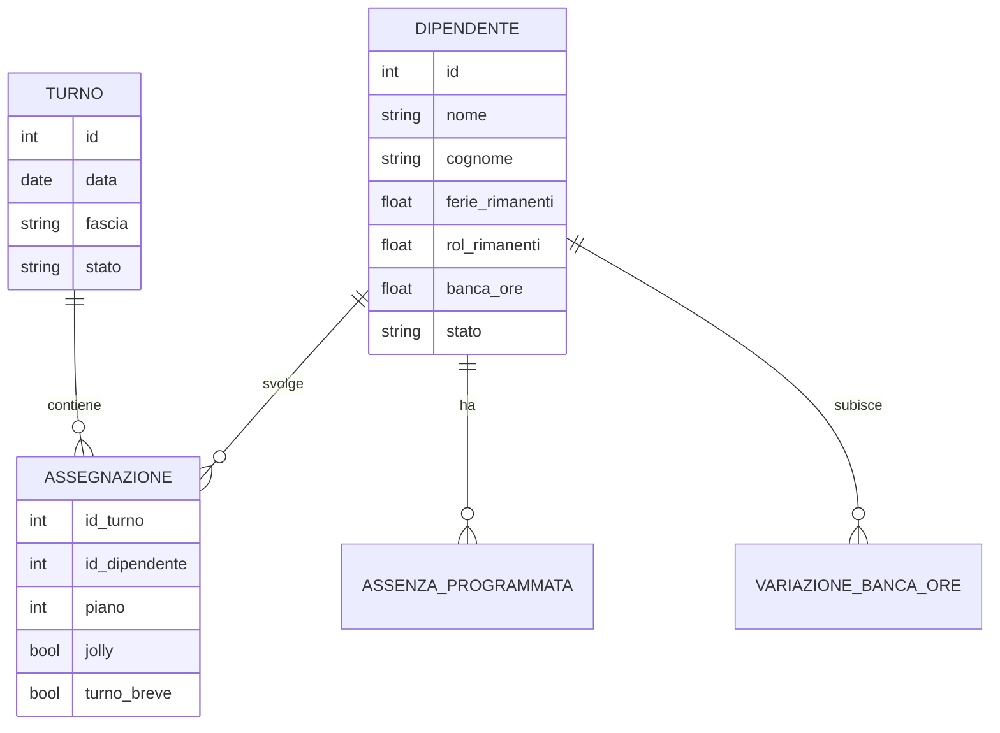

# Documentazione

# Product backlog

## Introduzione

Nell'ambito dell'organizzazione aziendale è fondamentale avere degli strumenti che supportino il dirigente nello svolgimento dei suoi compiti per ridurne il carico di lavoro.

L'organizzazione dei turni è uno di quei compiti che spesso sono complessi e richiedono una grande quantità di tempo. Per questo un sistema che ne genera in automatico una bozza revisionabile può permettere di ridurre le risorse in termini di tempo e stress.

## Contesto di business

Il software costruito può essere riadattato e utilizzato per molte aziende e contesti diversi.

L'obiettivo iniziale però è quello di soddisfare le esigenze di una onlus per la gestione della turnazione degli OSS.

## Stakeholder

Gli stakeholder principati interessati a tale sistema sono i seguenti:

1. Proprietario: la figura a capo dell'azienda che delibera sulle decisioni ed è interessato al corretto funzionamento dell'azienda in tutte le sue parti.
2. Dirigente: la figura sottoposta al proprietario che svolge i compiti di dirigenza al suo posto. Tra cui anche la turnazione.
3. OSS: i dipendenti che ricevono dal dirigente i turni e lavorano in azienda.
Poichè i compiti del proprietario e del dirigente sono simili possiamo accorparli.

## Item funzionali

Contiene l’elenco e la specifica di tutti i requisiti funzionali espressi attraverso lo schema delle user stories:

```
COME <ruolo>
DEVO POTER <fare qualcosa>
PER CONSEGUIRE <un risultato >
```

1.  **IF-1 (Gestione Personale)**: COME dirigente DEVO poter gestire l'elenco dipendenti (assunzione/licenziamento) PER mantenere aggiornata la forza lavoro.
2.  **IF-2 (Visualizzazione Turni)**: COME dirigente DEVO conoscere la turnazione passata e futura PER pianificare le risorse.
3.  **IF-3 (Monitoraggio Stati)**: COME dirigente DEVO conoscere lo stato dei turni (Generato, Modificato, Approvato) PER gestire il workflow di pubblicazione.
4.  **IF-4 (Generazione Automatica)**: COME dirigente DEVO poter generare i turni automaticamente PER risparmiare tempo e garantire la rotazione delle festività.
5.  **IF-5 (Modifica Manuale)**: COME dirigente DEVO poter correggere manualmente i turni PER gestire emergenze o richieste specifiche.
6.  **IF-6 (Sostituzione Guidata)**: COME dirigente DEVO poter trovare rapidamente un sostituto idoneo PER coprire un turno lasciato scoperto da un'assenza improvvisa.
7.  **IF-7 (Esportazione PDF)**: COME dirigente DEVO poter esportare i turni in PDF PER la consultazione cartacea in struttura.
8.  **IF-8 (Gestione Assenze)**: COME dirigente DEVO inserire ferie, ROL e certificati medici PER impedire al sistema di assegnare turni a dipendenti assenti.
9.  **IF-9 (Banca Ore)**: COME dirigente DEVO poter approvare la settimana PER consolidare il saldo ore (straordinari/recuperi) nella banca ore dei dipendenti.
10. **IF-10 (Automatismo Riposi)**: COME dirigente VOGLIO che il sistema assegni i riposi obbligatori post-notte PER garantire la salute dei dipendenti e il rispetto dei vincoli legali.

## Item non funzionali

### Item informativi
1. **IIN-1 (Dati Dipendente)**: Nome, Cognome, Stato, Ferie/ROL rimanenti, Saldo Banca Ore, Lista Variazioni Storiche.
2. **IIN-2 (Dati Turno)**: Data, Fascia (Mattina, Pom, Notte, Riposo), Assegnazioni (Dipendente, Piano 0-2, Jolly, Turno Breve).
3. **IIN-3 (Vincoli Legali)**:
    - Riposo minimo tra turni: 11 ore.
    - Riposo settimanale: 24 ore consecutive ogni 7 giorni.
    - Media oraria: max 48 ore/settimana su un periodo di 4 mesi.
    - Automatismo Notte: 2 giorni di riposo garantiti dopo un turno di notte.
4. **IIN-4 (Algoritmo Rotazione)**: Priorità a chi non svolge una determinata fascia o festività da più tempo.
5. **IIN-5 (Configurazione)**: Limiti di personale personalizzabili per ogni piano e ogni fascia oraria.

## Specifiche richieste del prodotto

### Diagramma casi d’uso


### Specifiche casi d’uso

| Caso d’uso | AggiuntaDipendenti |
| --- | --- |
| ID | 1 |
| Breve descrizione | Aggiunge i dipendenti che lavorano nell’azienda o che sono stati assunti per inserirli nella turnazione  |
| Attori primari | Dirigente |
| Attori secondari |  |
| Precondizioni |  |
| Sequenza principale degli elementi |   1. Il caso d’uso inizia quando è stato assunto un nuovo OSS in azienda o nella configurazione iniziale del sistema
  2. il dirigente si reca nella sezione dipendenti
  3. e poi nella sezione dell’aggiunta
  4. inserisce tutti i dati necessari
  5. il sistema crea il nuovo dipendente |
| Post-condizioni | un nuovo dipendente è stato inserito nel sistema |
| Sequenza alternativa degli eventi |  |

| Caso d’uso | Rimozione Dipendenti |
| --- | --- |
| ID | 2 |
| Breve descrizione | Rimuove un dipendente presente nel sistema che è stato licenziato per non farlo apparire nella turnazione |
| Attori primari | Dirigente |
| Attori secondari |  |
| Precondizioni | Il dipendente che si vuole rimuovere deve essere presente nel sistema |
| Sequenza principale degli elementi |   1. il caso d’uso inizia quando è stato licenziato un dipendente dall’azienda
  2. il dirigente si reca nella sezione dipendenti
  3. seleziona l’opzione elimina per il dipendente in questione
  4. conferma l’operazione
  5. il sistema elimina il dipendente |
| Post-condizioni | il dipendente è stato rimosso dal sistema |
| Sequenza alternativa degli eventi |  |

| Caso d’uso | Visualizza Turnazione |
| --- | --- |
| ID | 3 |
| Breve descrizione | Mostra la passata, l’attuale e la futura turnazione registrata o generata nel sistema |
| Attori primari | Dirigente |
| Attori secondari |  |
| Precondizioni |  |
| Sequenza principale degli elementi |   1. il caso d’uso inizia quando il dirigente decide di visualizzare la turnazione
  2. il dirigente si reca nella sezione turnazione ed eventualmente imposta la settimana da visualizzare
  3. il sistema recupera la turnazione della settimana selezionata o quella attuale
  4. se non è stata registrata una turnazione per quella settimana 
    4.1. il sistema mostra la settimana vuota e l’opzione per generarla o crearla da zero
  5. altrimenti
    5.1. viene mostrata la turnazione in questione |
| Post-condizioni |  |
| Sequenza alternativa degli eventi |  |

| Caso d’uso | Genera Turnazione |
| --- | --- |
| ID | 4 |
| Breve descrizione | Il sistema genera la turnazione a partire dai requisiti forniti precedentemente |
| Attori primari | Dirigente |
| Attori secondari |  |
| Precondizioni | la settimana che si vuole generale deve essere vuota o devono esserci state delle modifiche che implicano un ricalcolo (concessione di ferie, roll, permessi) |
| Sequenza principale degli elementi |   1. il caso d’uso inizia quando il dirigente decide di generare la turnazione
  2. il dirigente si reca nella settimana da generare
  3. se la settimana in questione è vuota
    3.1. il dirigente seleziona l’opzione genera
    3.2. il sistema esegue il calcolo e mostra la turnazione generata
4. se la settimana non è vuota ma ci sono state delle modifiche che implicano il ricalcolo
    4.1. il dirigente seleziona l’opzione ricalcola
    4.2. il sistema ricalcola la turnazione e la mostra al proprietario
5. altrimenti 
    5.1. il sistema informa che la turnazione è già stata generata e che è possibile apportarne delle modifiche o approvarla ed esportarla) |
| Post-condizioni | il sistema avrà generato la turnazione o avrà informato al dirigente che è già stata generata o creata |
| Sequenza alternativa degli eventi |  |

| Caso d’uso | Crea Turnazione |
| --- | --- |
| ID | 5 |
| Breve descrizione | Consente al dirigente di creare da zero la turnazione da zero nel caso in cui ci sono delle esigenze particolari che non consentirebbero una generazione ottimale |
| Attori primari | Dirigente |
| Attori secondari |  |
| Precondizioni | La settimana per cui si vuole **creare** la turnazione deve essere vuota |
| Sequenza principale degli elementi |   1. il caso d’uso inizia quando il dirigente decide di creare una turnazione da zero
  2. il dirigente si reca nella sezione turnazione
  3. seleziona la settimana per cui vuole creare la turnazione
  4. aggiunge i dipendenti per ogni turno
  5. conferma la creazione della turnazione
  6. il sistema registra e mostra la turnazione creata |
| Post-condizioni | il sistema avrà salvato la turnazione creata |
| Sequenza alternativa degli eventi |  |

| Caso d’uso | Modifica Turnazione  |
| --- | --- |
| ID | 6 |
| Breve descrizione | Consente al dirigente di modificare una turnazione già esistente (generata o creata da zero)  |
| Attori primari | Proprietario |
| Attori secondari |  |
| Precondizioni | La turnazione che si vuole modificare deve essere stata già generata o creata da zero |
| Sequenza principale degli elementi |   1. il caso d’uso inizia quando il dirigente decide di apportare delle modifiche alla turnazione presente
  2. il dirigente si reca nella sezione turnazione
  3. seleziona una settimana già generata/creata da modificare
  4. sceglie tra le opzioni modifica
  5. applica tutte le modifiche che ritiene necessarie
  6. salva il risultato finale
  7. il sistema salva le modifiche e mostra la turnazione aggiornata  |
| Post-condizioni | il sistema avrà salvato le modifiche apportate |
| Sequenza alternativa degli eventi |  |

| Caso d’uso | Aggiunta Ferie Roll |
| --- | --- |
| ID | 7 |
| Breve descrizione | Consente al dirigente di aggiungere le ferie richieste dai dipendenti |
| Attori primari | Proprietario |
| Attori secondari |  |
| Precondizioni | il dipendente deve aver maturato le ferie richieste (o essere consapevole che le nuove ferie maturate andranno in compensazione del debito creato) |
| Sequenza principale degli elementi |   1. il caso d’uso inizia quando un dipendente richiede delle ferie / roll  
  2. il dirigente si reca nella sezione turnazione o dipendenti
  3. seleziona l’opzione aggiungi ferie al dipendente in questione
  4. sceglie il periodo / la durata delle ferie
  5. salva la creazione delle ferie
  6. il sistema salva le modifiche e mostra le ferie rimanenti al lavoratore aggiornate 
  7. se in quel periodo sono già stati generati i turni avvisa il proprietario |
| Post-condizioni | il sistema avrà salvato le modifiche apportate |
| Sequenza alternativa degli eventi |  |

| Caso d’uso | Esportazione Turnazione |
| --- | --- |
| ID | 8 |
| Breve descrizione | Consente al proprietario di esportare la turnazione |
| Attori primari | Dirigente |
| Attori secondari |  |
| Precondizioni | La turnazione che si vuole esportare deve essere stata generata e approvata o creata da zero |
| Sequenza principale degli elementi |   1. il caso d’uso inizia quando il dirigente decide di esportare la turnazione
  2. il dirigente si reca nella turnazione da esportare
  3. seleziona l’opzione esporta turnazione
  4. riceve dal sistema un pdf |
| Post-condizioni | il sistema genererà un pdf con la turnazione selezionata |
| Sequenza alternativa degli eventi |  |

| Caso d’uso | AggiuntaFerieMaturate |
| --- | --- |
| ID | 9 |
| Breve descrizione | Consente al sistema di aggiornare automaticamente le ferie e roll maturati dai dipendenti |
| Attori primari | Sistema |
| Attori secondari |  |
| Precondizioni | il sistema è stato appena aperto, ci troviamo nell’ultimo giorno del mese oppure è trascorso più di un mese dall’ultimo aggiornamento |
| Sequenza principale degli elementi |   1. il caso d’uso inizia quando il sistema viene aperto
  2. viene controllato il giorno attuale e l’ultimo aggiornamento eseguito alle assenze maturate
  3. se il mese/anno di ultimoAggiornamento è uguale al mese/anno corrente
    3.1. interrompiamo la sequenza
 4. altrimenti
    4.1. calcoliamo quanti mesi sono trascorsi tra ultimoAggiornamento e l'ultimo giorno del mese precedente a oggi
    4.2. aggiorniamo i dati moltiplicando il valore mensile per i mesi trascorsi
    4.3. salviamo come ultimoAggiornamento l'ultimo giorno del mese precedente |
| Post-condizioni | il sistema avrà aggiornato il conteggio delle assenze rimanenti  |
| Sequenza alternativa degli eventi |  |

| Caso d’uso | Approvazione Settimana |
| --- | --- |
| ID | 10 |
| Breve descrizione | Blocca la settimana e consolida le ore lavorate nella banca ore dei dipendenti |
| Attori primari | Dirigente |
| Precondizioni | I turni della settimana devono essere completi |
| Sequenza principale degli elementi | 1. Il dirigente visualizza la settimana conclusa<br>2. Seleziona "Approva"<br>3. Il sistema calcola il saldo (Ore Lavorate + Ore Assenza - 38h)<br>4. Il sistema aggiorna la Banca Ore dei dipendenti<br>5. I turni vengono bloccati (Sola lettura) |

# Architettura del sistema

## Diagramma delle componenti


### Specifica componenti
- Interfaccia proprietario: utilizza le interfacce esposte degli altri componenti per consentire al proprietario di eseguire tutte le funzioni di cui necessità

### Specifica delle interfacce

- Interfaccia dipendenti turnazione: consente al sistema delle turnazioni di recuperare tutti i dati dei dipendenti necessari per l’assegnazione di tale dipendente ad uno specifico turno
- Interfaccia turnazione: consente all’interfaccia del proprietario di utilizzare le funzioni necessarie per la creazione, la modifica, le generazione e l’esportazione delle turnazioni
- Interfaccia gestione dipendenti: consente all’interfaccia del proprietario di aggiungere e rimuovere i dipendenti dall’azienda, oltre ad aggiungere e le ferie ecc.
- Interfaccia salvataggio dipendenti: consente di recuperare le informazioni dei dipendenti salvate all’avvio dell’app e di salvarle una volta modificate

## Diagramma delle classi


### Specifiche delle classi

- Turnazione: questa classe contiene al suo interno l’intero storico della turnazione salvata o modificata, e lo fa attraverso le classi FasciaOraria e AssegnazioneTurno. inoltre contiene le funzioni per la modifica, l’approvazione e la creazione delle turnazioni
- FasciaOraria: questa classe permette di definire il singolo turno
- AssegnazioneTurno: permette di definire quali saranno i dipendenti assegnati al turno, su quale piano lavoreranno e se hanno il jolly.
- SistemaGenerazione: permette di eseguire la logica che genera i turni della settimana in questione. Espone la funzione generate.
- SistemaEsportazione: permette di esportare la turnazione selezionata in formato pdf
- SistemaDipendenti: permette di definire quali sono i dipendenti presenti in azienda e espone i metodi che ne consentono l’aggiunta, la rimozione e l’assegnazione delle assenze.
- Dipendente: definisce gli attributi che ogni dipendente deve avere, tra cui:
    - nome
    - cognome
    - stato
    - ferie rimanenti
    - …
- AssenzaProgrammata: permette di concedere ai dipendenti le ferie. Definendone la tipologia, la data di inizio e di fine.

## Diagrammi di sequenza
### Generazione Automatica Turni


### Approvazione Settimana e Banca Ore


## Modello EER
